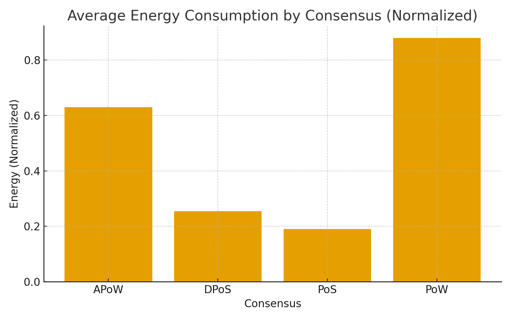
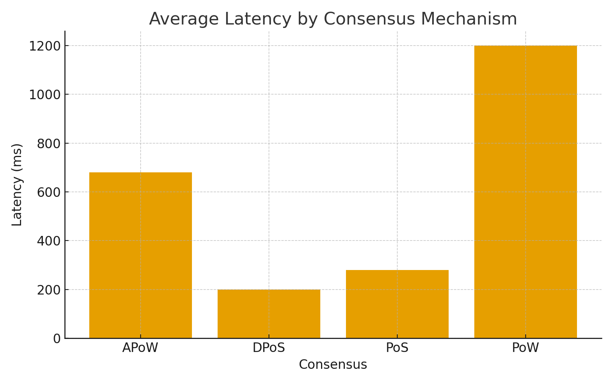
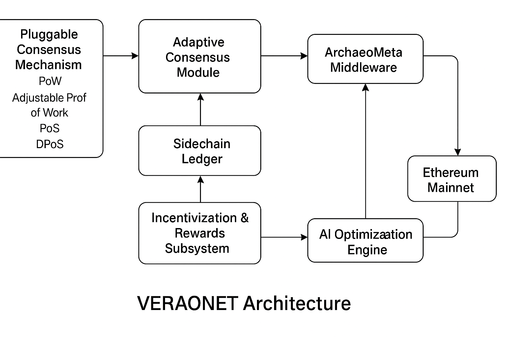

🏛️ VERAONET-Layer2-Simulation

Author: Omer Aziz
Affiliation: University of Management and Technology, Lahore, Pakistan
Email: f2018288006@umt.edu.pk

Associated Publication:

Aziz, O., Farooq, M.S., Khelifi, A., & Omer, A. (2025). VERAONET: A Virtual Ecosystem for Rewards and Archaeological Operations Network. npj Heritage Science.

📖 Overview

VERAONET is a Layer-2 blockchain framework introducing an adaptive, pluggable consensus mechanism to optimize scalability, energy efficiency, and cost for digital heritage workflows.
It dynamically switches between:

🧩 Consensus Modes: PoW ▸ APoW ▸ PoS ▸ DPoS
⚙️ Driven by: real-time metrics for network load, latency, and energy.
🌍 Validated on: Ganache (local) and Geth (public) environments.

🧩 Repository Structure

⚙️ Experimental Setup
Dependencies

Go ≥ 1.21 | Python ≥ 3.11 | Node.js ≥ 20

Ganache CLI ≥ 7.9 | Geth ≥ 1.14

Python libraries: pandas, matplotlib, argparse

Configuration

Edit thresholds in adaptive-consensus/config_thresholds.json:

{
  "low_load": 250,
  "medium_load": 2500,
  "high_load": 7000,
  "latency_threshold": 500,
  "energy_threshold": 0.70
}

🚀 Running Experiments
1️⃣ Generate Synthetic Metrics
python3 experiments/ganache_tests/run_simulation.py --users 500 --steps 50 --out experiments/results

→ Produces fresh CSVs under experiments/results/.

2️⃣ Execute Adaptive Consensus Selection
cd experiments/geth_tests
go run adaptive_switch.go --thresholds ../../adaptive-consensus/config_thresholds.json --metrics ../results/latency_results.csv

→ Outputs decisions.csv, showing consensus chosen per simulation step.

📊 Results Visualization
Metric	Preview	Description
Energy Efficiency		Average normalized energy by consensus type
Latency		Average latency (ms) for PoW, APoW, PoS, and DPoS

💡 To reproduce charts:
jupyter notebook visualization/plots.ipynb

🧱 System Architecture

  

Flow:
Client Apps → API Gateway → L2 Nodes → Adaptive Consensus (PoW/APoW/PoS/DPoS) → Sidechain Bridge → L1 (Geth) → Storage (IPFS/DB) → Monitoring Layer

📘 Documentation
File	Description
Algorithm1_AdaptiveConsensus.pdf
	Pseudocode for adaptive consensus switching
SystemArchitecture_Figure3.png
	System architecture diagram
EvaluationReport.md
	Experimental setup, metrics, and summary results
⚖️ License & Attribution

This work builds on the open-source Go Ethereum (Geth) codebase:
https://github.com/ethereum/go-ethereum

Licensed under GNU LGPL v3.0.

All scripts, configurations, and data here are distributed under the same license with full attribution.

📚 Citation
@article{aziz2025verao,
  title={VERAONET: A Virtual Ecosystem for Rewards and Archaeological Operations Network},
  author={Aziz, Omer and Farooq, Muhammad Shoaib and Khelifi, Adel and Omer, Abdullah},
  journal={npj Heritage Science},
  year={2025}
}

🌟 Acknowledgment

This research was supported by Abu Dhabi University and the University of Management and Technology, Lahore, under the collaborative initiative on Blockchain for Digital Heritage Preservation.
